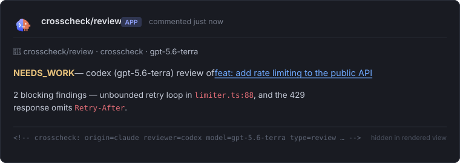
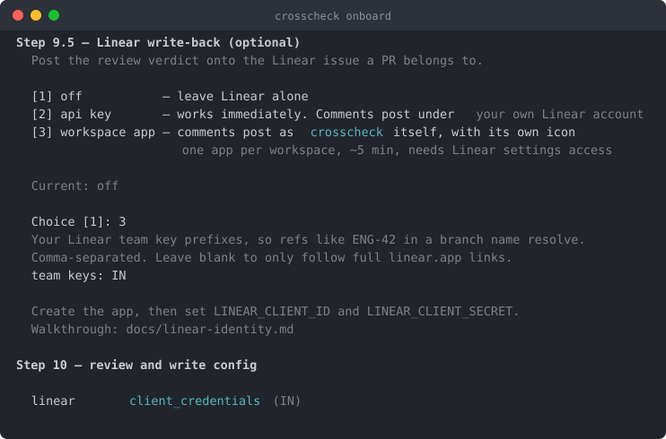
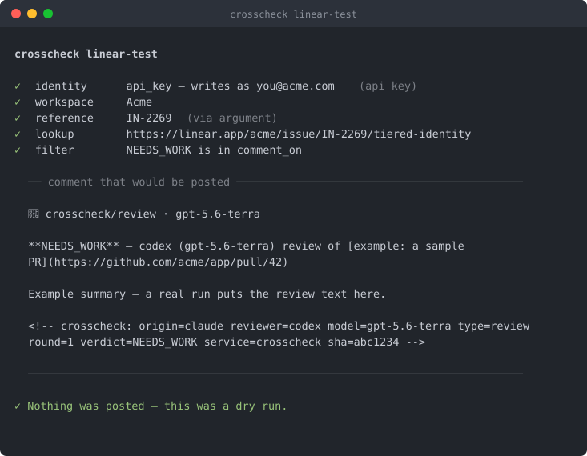
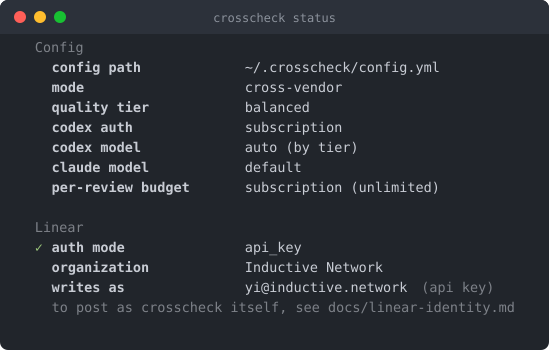

<div align="right">
  <h5><a href="./README.zh.md">🌏 &nbsp;中文</a></h5>
</div>

<p align="center">
  
</p>

<h1 align="center">crosscheck</h1>

<p align="center"><strong>Your agents ship fast. Crosscheck makes sure they ship right.</strong></p>

<p align="center">
  <a href="https://www.npmjs.com/package/@humanbased/crosscheck"></a>
  <a href="./LICENSE"></a>
  <a href="https://nodejs.org"></a>
</p>

<p align="center">
  
</p>

---

## The problem

AI coding agents open PRs faster than review habits can absorb them. The failure mode isn't a broken build — it's **early victory**: a patch that passes CI, reads as complete, and quietly carries a regression, a brittle edge case, or a half-finished fix.

Asking the agent that wrote the patch to review it doesn't help. That's exactly where early victory hides.

## What crosscheck does

One agent writes the patch. **A different one reviews it.** Findings go back to the author agent to repair, and the result is rechecked before merge.

```
PR  →  review  →  fix  →  recheck  →  merge-ready
       (codex)   (claude) (codex)
```

Three properties make that practical:

- **Independent eyes.** Claude-authored PRs route to Codex and vice versa. Origin is detected from the PR body, commit trailers, and branch prefix — no manual tagging.
- **A loop, not a comment.** Findings return to the author agent for repair; a clean recheck follows. The PR moves forward instead of sideways.
- **No new vendor.** Runs through the `claude` and `codex` CLIs you already pay for. No hosted service, no per-review API bill, no extra trust surface.

Built by [Humanbased](https://github.com/humanbased-ai). Field report: [What 295 Agentic PRs Taught Us About Code Review](https://blog.humanbased.ai/posts/agentic-pr-quality-crosscheck/).

---

## Install

```bash
npm install -g @humanbased/crosscheck
```

<details>
<summary>Other channels</summary>

```bash
npm install -g @humanbased/crosscheck@beta   # latest features, rougher edges
npx @humanbased/crosscheck <command>         # no install

git clone https://github.com/humanbased-ai/crosscheck
cd crosscheck && npm install && npm run build && npm link
```
</details>

You need GitHub CLI plus **at least one** reviewer CLI. Install both only if you want cross-vendor routing.

```bash
gh auth login
npm install -g @anthropic-ai/claude-code && claude       # Claude Pro or Max
npm install -g @openai/codex && codex login --device-auth # ChatGPT Plus or Pro
```

Both reviewers run on your existing subscription — no API key required.

## First review in two minutes

```bash
crosscheck status                                         # confirm auth
crosscheck review https://github.com/humanbased-ai/crosscheck-proof-fixture/pull/1 --reviewer codex
```

That clones the branch, reviews it against base, and posts a comment on the PR. Once the fixture produces a useful verdict, point it at one low-risk PR of your own — then set up continuous review:

```bash
crosscheck onboard   # guided: repos, routing, pipeline depth, connection
crosscheck watch     # listen for PR events
```

---

## Where results land

### On the pull request

Every review posts a comment carrying a machine-readable annotation:

```
<!-- crosscheck: origin=claude reviewer=codex model=gpt-5.6-terra
     type=review round=1 verdict=NEEDS_WORK service=crosscheck sha=a1b2c3d -->
```

That tag is the audit trail. It's how crosscheck knows which step ran, what verdict came back, and what to do next — and it's a stable contract you can parse.

### On your Linear issue

Optional, off by default. When enabled, the verdict is mirrored onto the Linear issue the PR belongs to, so outcomes show up where work is planned:

<p align="center">
  
</p>

Attribution is a ladder — **start at the bottom, climb only if you need to**:

| Rung | Setup | Comments appear as |
|---|---|---|
| **api key** | one env var | Your Linear account, with a `🤖 crosscheck · <model>` signature line |
| **workspace app** | one OAuth app, ~5 min, once per workspace | crosscheck itself, with its own icon |

The API key rung is fully functional — it finds the issue and posts the comment. What it lacks is *attribution*, not capability. So the question isn't which is better, it's **how many things write to your workspace**. If you're the only one, the app is ceremony.

`crosscheck onboard` asks which rung you want and writes the config:

<p align="center">
  
</p>

To check a setup without waiting for a PR, `linear-test` runs the whole path and posts nothing:

<p align="center">
  
</p>

<details>
<summary>Confirming which rung you're on at any time</summary>

`crosscheck status` resolves the configured identity for real and reports what a write would render as:

<p align="center">
  
</p>
</details>

Full walkthrough: **[docs/linear-identity.md](./docs/linear-identity.md)**.

---

## Commands

| Command | What it does |
|---|---|
| `crosscheck onboard` | Guided setup — repos, routing, pipeline depth, connection |
| `crosscheck status` | Auth, config, Linear identity, logs, impact summary |
| `crosscheck skill install <source>` | Install an Agent Skill from Git or a local directory |
| `crosscheck review <pr>` | One-shot review, posts a comment |
| `crosscheck run <pr>` | Full pipeline for a PR — review, fix, recheck |
| `crosscheck recheck` / `fix` / `resolve` | Run one step in isolation |
| `crosscheck watch` | Listen for PR events and run the pipeline automatically |
| `crosscheck scan` | Show open PRs with stale crosscheck state |
| `crosscheck kickass` | Pick a stale PR and drive it to its next step |
| `crosscheck alter <repo>` | Set a per-repo pipeline depth |
| `crosscheck detect-step <pr>` | Show step history and the next step to run |
| `crosscheck linear-test [issue]` | Dry-run Linear write-back |
| `crosscheck diagnose` / `optimize` / `impact` / `issue` | Analyse logs, tune config, report value, file tickets |

Multi-PR forms work where sensible — comma lists, bare numbers, and ranges:

```bash
crosscheck review https://github.com/acme/app/pull/245,255
crosscheck run    https://github.com/acme/app/pull/245-256 --concurrent 4
```

Full flag reference: **[get-started.md](./get-started.md)**.

---

## Configuration

Config lives at `~/.crosscheck/config.yml`. A `./crosscheck.config.yml` in the working directory is treated as a deliberate per-project override.

### Review depth

```yaml
quality:
  tier: balanced    # fast | balanced | thorough

skills:
  enabled:
    - code-review-skill  # bundled by @awesome-skills, MIT
```

| Tier | Claude | Codex | Latency |
|---|---|---|---|
| `fast` | Haiku 4.5 | GPT-5.6 Luna | ~10s |
| `balanced` | Sonnet 5 | GPT-5.6 Terra | ~30s |
| `thorough` | Opus 4.8 | GPT-5.6 Sol | ~60s |

### Pipeline depth

The global pipeline lives in `~/.crosscheck/workflow.yml` and defaults to the full loop:

```yaml
steps:
  - name: review
    type: review
    reviewer: auto            # auto | claude | codex | origin
  - name: fix
    type: fix
    reviewer: origin
    when: review.verdict != 'APPROVE'
  - name: recheck
    type: recheck
    reviewer: auto
    when: fix.applied_count > 0
```

To narrow a single repo without touching the global default:

```bash
crosscheck alter acme/app --review-only     # or --steps review,fix
```

That writes a standalone override at `~/.crosscheck/workflows/<owner>__<repo>.yml`, live-reloaded per PR — no watcher restart.

Every option, annotated: **[crosscheck.config.example.yml](./crosscheck.config.example.yml)**.

---

## Running it continuously

**On your machine** — a watcher for as long as your terminal is open. Webhooks arrive through a tunnel (`localhost.run` by default, zero config; `smee` if you want events queued while you're offline).

```bash
crosscheck onboard && crosscheck watch
```

**On a server** — one always-on watcher for a team, with per-repo depth where it matters.

```bash
crosscheck onboard --team
crosscheck alter acme/legacy-service --review-only
crosscheck watch
```

Deployment mode decides scope: `personal` monitors your own repos and reviews only PRs you author; `team` monitors org repos and reviews PRs from any author.

---

## Requirements

| | Minimum |
|---|---|
| Node.js | 18+ |
| Claude Code CLI | `npm install -g @anthropic-ai/claude-code` |
| Codex CLI | `npm install -g @openai/codex` |
| GitHub CLI | 2.65+ — `brew install gh` |

`GITHUB_TOKEN` is derived automatically from `gh auth login`. No manual export needed.

---

## Documentation

| | |
|---|---|
| **[get-started.md](./get-started.md)** | Full setup guide — prerequisites, every flag, complete config reference, FAQ |
| **[docs/linear-identity.md](./docs/linear-identity.md)** | Linear write-back and the attribution ladder |
| **[docs/linear-identity-contract.md](./docs/linear-identity-contract.md)** | The identity contract, as a spec for other tools |
| **[What 295 Agentic PRs Taught Us About Code Review](https://blog.humanbased.ai/posts/agentic-pr-quality-crosscheck/)** | Field report on agentic PR quality and why crosscheck exists |
| **[docs/fixture-pr.md](./docs/fixture-pr.md)** | The safe public fixture PR |
| **[crosscheck.config.example.yml](./crosscheck.config.example.yml)** | Annotated config with every option |
| **[CHANGELOG.md](./CHANGELOG.md)** | Release notes |

---

## Contributing

Issues and PRs welcome at [github.com/humanbased-ai/crosscheck](https://github.com/humanbased-ai/crosscheck).

## License

[MIT](./LICENSE) — Copyright (c) 2025–2026 Humanbased AI PTE LTD.

<p align="center"><em>A Humanbased project, built with crosscheck.</em></p>
